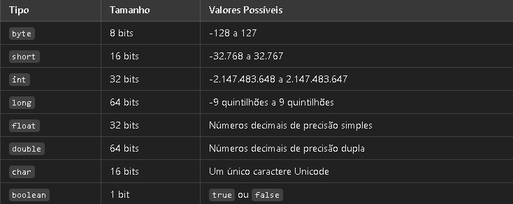
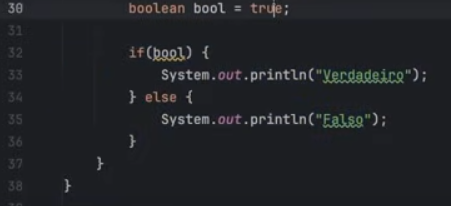

# Sobrecarga, Construtores e Associações em JAVA - Do ZERO a VAGA #3
 - Java compiler


- Java access modifiers

1. Public é acessível de qualquer classe.
2. Protected é acessível para seu pacote ou subclasses.
3. Default é acessível apenas no seu pacote ou classe.
4. Private é acessivel apenas na sua propria classe.

### Construtores
Os construtores em java são os responséveis por criar o objeto em memória, ou seja, por instanciar a classe que foi definida,
eles são obrigatórios para as classes.
- A declaração de um construtor segue a seguinte assinatura: modificadores de acesso como (public), seguido pelo nome da classe , e então os parâmetros que podem ser nenhum, Os construtores podem ter diferentes tipos de acesso: public , private ou protected.

## ESTUDO DE REVISÃO DIA 08/03/2025
### variáveis JAVA


Linguagem da maquina basicamente zero e um.
- Bit → Menor unidade (0 ou 1).
- Byte → 8 bits, suficiente para armazenar um caractere.

# Condicionais em Java
 - if/else: Explicação de como a condição if é avaliada e o bloco de código correspondente é executado se a condição for verdadeira. O bloco else é executado se a condição if for falsa. Também é abordada a possibilidade de usar if sozinho e o encadeamento de múltiplos if/else.


- switch/case: Apresentação como uma alternativa ao uso de múltiplos if/else para testar o valor de uma variável contra diferentes casos. É explicado o uso das palavras-chave case para definir as opções, break para delimitar o final de cada caso e default para o caso em que nenhum dos valores corresponda.
````
int dia = 3;
switch (dia) {
case 1:
System.out.println("Domingo");
break;
case 2:
System.out.println("Segunda-feira");
break;
case 3:
System.out.println("Terça-feira");
break;
default:
System.out.println("Dia inválido");
} 
````

# Estrutura de dados
- Vetor(Arrays)
Em Java, vetores são representados por arrays, que são coleções ordenadas de elementos do mesmo tipo. Eles armazenam múltiplos valores em uma única variável, permitindo acesso direto por meio de índices.
````
  nt[] numeros = {10, 20, 30, 40, 50};
  System.out.println(numeros[2]); // Saída: 30
````
- ArrayList
  ArrayList é uma classe do Java que permite armazenar coleções de elementos de forma dinâmica, ou seja, sem um tamanho fixo. É uma implementação da interface List do Java e está localizada no pacote java.util. 
````
  ArrayList<String> nomes = new ArrayList<>();
  nomes.add("Ana");
  nomes.add("Carlos");

        System.out.println(nomes.get(0)); // Saída: Ana
        nomes.remove("Carlos"); // Remove Carlos da lista
````

# Loops

- Loop for 
O loop for é como uma contagem. Você diz ao computador para contar de 1 até 5, e ele vai fazer isso sozinho
````
for (int i = 1; i <= 5; i++) {
    System.out.println(i);
}

````

- Loop While
No loop while, você diz ao computador para fazer algo enquanto uma condição for verdadeira.
````
int i = 1;
while (i <= 5) {
    System.out.println(i);
    i++;  // Aumenta 1 a cada vez
}

````
- Loop do-while
  Esse loop é parecido com o while, mas com uma diferença: ele vai fazer o trabalho pelo menos uma vez, mesmo que a condição não seja verdadeira.
````
int i = 1;
do {
    System.out.println(i);
    i++;  // Aumenta 1 a cada vez
} while (i <= 5);

````

- Loop for-each
  Esse loop é usado quando você tem uma lista de coisas e quer fazer a mesma coisa com cada uma delas, como se fosse uma fila de brinquedos para brincar.
````
int[] numeros = {10, 20, 30, 40, 50};

for (int num : numeros) {
    System.out.println(num);
}
````

# Casting
 Casting é o processo de conversão de um tipo de dado para outro em Java. Existem dois tipos principais de casting:

1. Casting Implícito (Widening Casting)
Acontece automaticamente quando convertemos um tipo menor para um tipo maior Exemplo: de int para double.

2. Casting Explícito (Narrowing Casting)
Precisa ser feito manualmente quando convertemos um tipo maior para um tipo menor.
Exemplo: de double para int.

````
EX:1
public class Main {
    public static void main(String[] args) {
        int numeroInt = 10;
        double numeroDouble = numeroInt; // Conversão automática

        System.out.println("Número inteiro: " + numeroInt);
        System.out.println("Número convertido para double: " + numeroDouble);
    }
}
````

````
EX:2
public class Main {
    public static void main(String[] args) {
        double numeroDouble = 9.78;
        int numeroInt = (int) numeroDouble; // Conversão manual

        System.out.println("Número double: " + numeroDouble);
        System.out.println("Número convertido para int: " + numeroInt);
    }
}
````